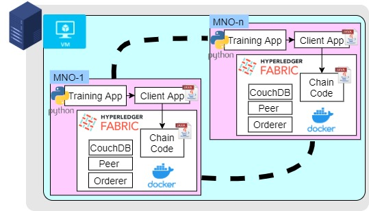

# ML Model Aggregation with HyperLedger

This repository contains the source code for the ML model aggregation. All the chaincodes and supporting applications are implemented using Java.

Figure below shows the implementation details

## Instructions to start

- Create the virtual machine using the provided vagrant file.
- SSH and access the virtual machine
- Follow the steps in [Installation](installation/) to install the required binary files
- Run the rebuilt-network-with-chaincode.sh in the network folder
- maskedfl folder contains the code for the chaincode
- application-java folder contains the Java project for handling model aggregation requests

